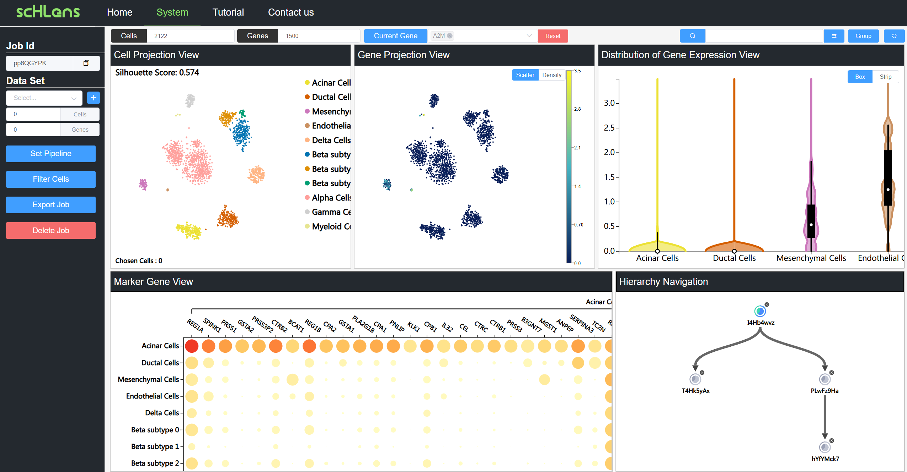

# scHLens - A Web Server for Hierarchically and Interactively Exploring Single Cell RNA-seq Data

This is the repository for scHLens. scHLens is an interactive analysis platform for hierarchically and interactively exploring cellular heterogeneity of scRNA-seq dataset, with various visualization views. scHLens focused on the cell type annotation of scRNA-seq. 



## Quick start

This web-server is based on `python 3.7.12`, `R 4.2.2`, `Node.js 16.19.0`. You can launch this web-server using the following steps:

(This web-server can run on both Windows and Linux platforms. we will take Linux platform as an example.)

**Step1. Download code**

```
git clone https://github.com/ZhiweiDeng459/scHLens.git
```

**Step2. Python prerequisites **

It is recommended to use Anaconda3 for managing the environment:

```
cd scHLens
conda create --name scHLens python=3.7.13
pip install -r ./scHLens_be/requirements.txt
```

**Step3. R prerequisites**

Install `R 4.2.2`, and then run the following commands:

```
cd scHLens
Rscript ./scHLens_be/package.R
ENV R_HOME=/usr/lib/R
```

**Step4. Node.js prerequisites**

Install `Node.js 16.19.0`, and then run the following commands:

```
cd scHLens/scHLens_fe
npm i
```

**Step5. Start front end**

```
cd scHLens/scHLens_fe
npm start
```

**Step6. Start backend end**

```
cd scHLens/scHLens_be
conda activate scHLens
python app.py
```

Then, you can access scHLens via http://localhost:8081 (local) or http://your_ip:8081(network)


## Additional Samples

+ scHLens provides three scRNA-seq datasets, 分别为 PBMC-3k , you can 从 XXX 下载它，然后将其解压为scHLens/scHLens_be的sample文件夹。
+ scHLens provides three datasets , you can 从 XXX 下载它，然后将其解压为scHLens/scHLens_be的sample_job文件夹。


## Docker version

We offer a deployable Docker version of scHLens (https://hub.docker.com/r/zhiweideng975/schlens), allowing users to effortlessly deploy and run the software on their own high-performance local servers.
