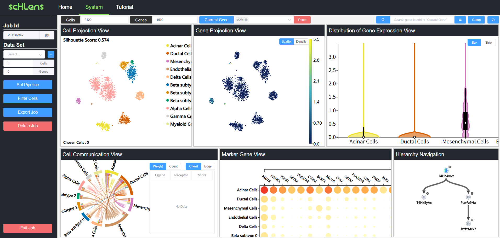

# scHLens - A Web Server for Hierarchically and Interactively Exploring Single Cell RNA-seq Data

This is the repository for scHLens. scHLens is an interactive analysis platform for hierarchically and interactively exploring cellular heterogeneity of scRNA-seq dataset, with various visualization views. scHLens focused on the cell type annotation of scRNA-seq. 




## Online version

We provide an online scHLens at http://schlens.csuligroup.com


## Docker version

We offer a deployable Docker version of scHLens (https://hub.docker.com/r/zhiweideng975/schlens), allowing users to effortlessly deploy and run the software on their own high-performance local servers.


## Quick start

This web-server is based on `python 3.7.12`, `R 4.2.2`, `Node.js 16.19.0`. You can launch this web-server using the following steps:

(This web-server can run on both Windows and Linux platforms. we will take Linux platform as an example.)

**Step1. Download code**

```
git clone https://github.com/ZhiweiDeng459/scHLens.git
```

**Step2. R prerequisites**

Install `R 4.2.2`, and then run the following commands:

```
cd scHLens
Rscript ./scHLens_be/package.R
export R_HOME=/usr/lib64/R 			#R directory
```

**Step3. Python prerequisites**

It is recommended to use Anaconda3 for managing the environment:

```
cd scHLens
conda create --name scHLens python=3.7.13
conda activate scHLens
pip install -r ./scHLens_be/requirements.txt
```

**Step4. Node.js prerequisites**

Install `Node.js 16.19.0`, and then run the following commands:

```
cd scHLens/scHLens_fe
npm i
```

**Step5. Start front end**

```
cd scHLens/scHLens_fe
npm start
```

**Step6. Start backend end**

```
cd scHLens/scHLens_be
conda activate scHLens
python app.py
```

Then, you can access scHLens via http://localhost:8081 (local) or http://your_ip:8081 (network)


## Additional Resource

+ scHLens provides three scRNA-seq datasets: PBMC-3K, Human Pancreatic dataset and Human Lung Cancer dataset. You can download them from http://www.csuligroup.com:32768/resource/sample.zip (`sample.zip`)，and then extract the contents into the `scHLens/scHLens_be/sample` folder:

  ```
  cd scHLens/scHLens_be
  wget http://www.csuligroup.com:32768/resource/sample.zip
  unzip sample.zip -d .
  ```

  These datasets will be added to the dataset list of your scHLens.

+ scHLens also provides three demos to illustrate the cases in our manuscript. You can download them from http://www.csuligroup.com:32768/resource/sample_job.zip (`sample_job.zip`)，and then extract the contents into the `scHLens/scHLens_be/sample_job` folder:

  ```
  cd scHLens/scHLens_be
  wget http://www.csuligroup.com:32768/resource/sample_job.zip
  unzip sample_job.zip -d .
  ```

  These demos can be loaded by 'Use Samples' button in the 'Enter a Job' dialog of scHLens.


## Hardware Requirements

We recommend allocating at least 8GB of memory space and 50GB of disk space for scHLens.


